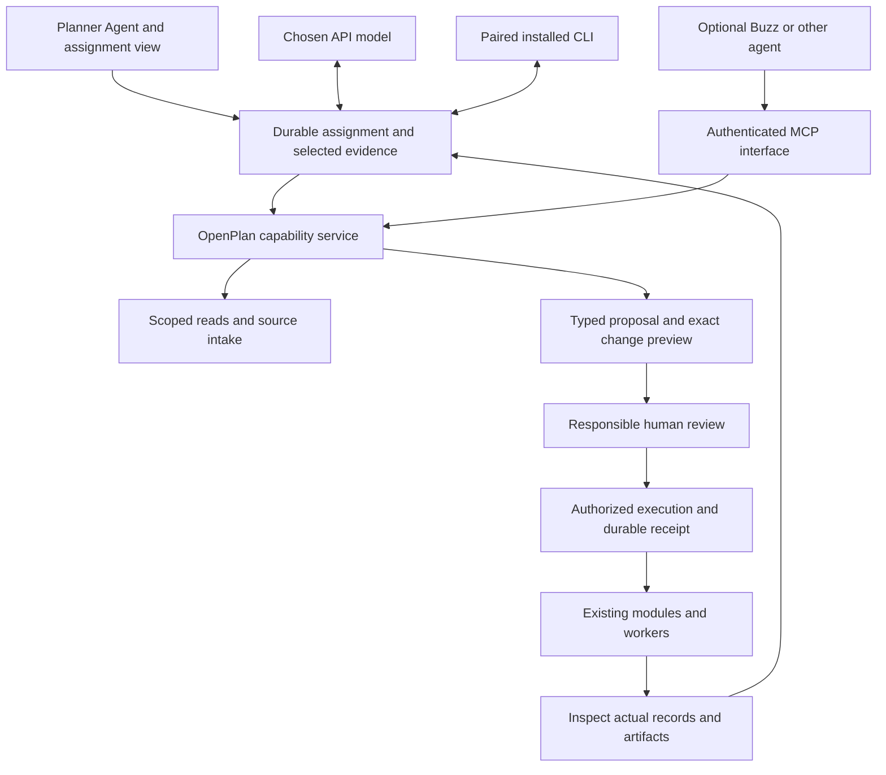

# Agentic control of OpenPlan: recommendation and implementation boundary

September 4, 2026. Proposed decision following Nathaniel's request to research Buzz, building within OpenPlan and established open-source options. This extends A0/A1 in the renewed roadmap; it does not launch implementation or replace the active developer's work.

## Recommendation

**Build a capable Planner Agent that can carry an assignment across OpenPlan. Extend the current application and reuse established agent/protocol components. Keep Buzz an optional compatible client, not a dependency or the owner of planning records.**

The impressive outcome is useful completed work: a planner supplies the previous RTP and gets a source-linked update workspace; asks for a weekly contract review and gets reconciled actuals, forecast risks and proposed follow-up; or commissions an engagement review and gets traceable themes, unanswered issues and reviewable responses. A visible plan, progress, source evidence, changes and recoverable artifacts matter more than a conversational personality. These are future outcomes, not descriptions of current capabilities.

Keep the existing Planner Agent name and entry points. Add an assignment/work view connected to Projects, plan documents and My Work. Chat remains a convenient way to give instructions and ask questions. The normal application remains fully usable without any model or external agent.

## What exists and what still needs building

Source review observed main e6900750e0472260b9a7ce774609ade774659f58. The current system is more than question-and-answer chat: it has source-grounded context, bounded read/proposal tools, twelve registered action kinds and client dispatch into existing routes. Examples include project/funding records, draft survey questions, report artifacts, RTP horizon scaffolding, stage-gate HOLD and relaunching an already configured model run. An action entry is not proof that every relevant workflow is reachable or complete.

The sampled chat route uses the existing AI SDK and Anthropic API with a bounded tool loop. It does not establish a durable assignment orchestrator, external authenticated agent identity or full-platform coverage. The detailed [current capability review](AGENTIC_CURRENT_CAPABILITY_REVIEW.md) inventories source paths, limits and actual execution boundaries. No browser, database or provider call was performed by this review.

Root independently traced three prerequisites:

1. **A failed action can be logged as succeeded.** In `openplan/src/app/api/stage-gates/decisions/route.ts:594–677`, the insert returns a resolved Supabase result with an error field. `withAssistantActionAudit` in `src/lib/observability/action-audit.ts:162–197` writes success when the promise resolves; the route checks the database error afterward. This is a source-established failure path, not a reproduced live incident.
2. **Approval consumption is not completion.** `verifyAssistantActionApproval` checks an exact payload, identity, expiry and single-use consumption, but consumption, business mutation and audit are separate requests. A crash or failed write can leave an approval spent with no completed action. Automatic retries need a durable execution identity and reconciliation, not repeated approval creation or an exactly-once promise.
3. **In-app attribution is not external authentication.** The current execution-source header selects the agent attribution/approval branch; ordinary human calls remain allowed. An external runner cannot receive a user's general session credentials and be trusted to label itself. Authenticated delegated identity, narrow case/action scope and server-enforced actor context must apply even when a header is omitted. An agent must not mint its own human approval.

Root also confirmed that a committed effect followed by preview-refresh failure can be shown as a failed chat proposal: `action-registry.ts:366–376` completes the effect before refreshing, while `app-copilot.tsx:2066–2092` catches the refresh exception and replaces the executed state. This needs separate effect and refresh results to prevent misleading retry. Explicit chat consent for safe/review actions is another narrower mismatch: a supplied approval can be minted but bypassed by the verifier's non-required tier, so actual human consent is not retained as verified consent. This does not establish an unauthorized write. Semantic read-tool errors/refusals likewise need a result status separate from successful function return.

Audit insertion itself is currently warning-only. Preserve successful business work while recording an explicit audit/reconciliation problem; do not claim everything rolled back if only the audit failed. For new consequential database actions, commit the effect and required execution record atomically where possible. For external workers or services, use durable dispatch/result identifiers and reconcile uncertain outcomes. Existing historical records remain unchanged.

## Build and reuse choices

| Layer | Recommended choice | Reason and accepted cost |
|---|---|---|
| Planning capabilities, source meaning and authority | Extend OpenPlan's typed action registry, role/RLS policy, approval system and existing domain routes/services | These are planning-specific and cannot be delegated to a generic agent framework. One tested execution service should serve browser and agent callers; do not create a direct database or shell bypass. |
| API-model reasoning and tools | Retain the installed AI SDK 6 initially, add A0 provider adapters | It already supports tool loops. New public examples target later versions, so upgrades require a separate compatibility check. No reason to rewrite the working model layer merely to gain an agent label. |
| Durable assignment lifecycle | A bounded Postgres-backed assignment/job state machine, run by an OpenPlan-owned worker and referencing existing domain jobs | Persist scope, steps, inputs, approvals, results and waits. This is product job state, not a new general agent framework. Prove one cross-module job before generalizing it. |
| Native CLI providers | A0's paired local connector using supported Codex, Claude Code and OpenCode interfaces; selective T3 reuse | Let each native runtime own its reasoning loop and authentication. The connector receives scoped OpenPlan tools and selected evidence, not the person's whole home or unrestricted credentials. |
| External agents, including Buzz | Thin MCP server over the same capability service, with version-tested client/transport adapters | OpenPlan remains the authoritative record. Buzz can be replaced without losing planning data or rewriting every action. A protocol claim alone does not prove interoperability. |
| More elaborate graph orchestration | LangGraph JS is the preferred fallback if the first durable assignment exposes branching/replay needs that the bounded job state cannot handle simply | Do not maintain two competing durable state owners. Evaluate persisted checkpoints, restart/approval replay, permissions and operator burden on the same task before adoption. No LangSmith or hosted runtime is required by this recommendation. |
| Agent UI components | Extend current React UI first; selectively reuse AG-UI/CopilotKit patterns/components only for a demonstrated missing interaction | A second chat shell does not supply planning semantics or durable work. Retain the current review surfaces and accessible non-chat controls. |

The [OSS comparison](AGENTIC_OSS_OPTIONS_RESEARCH.md) separates framework, tool-loop, protocol, UI and coding-runtime roles, and records current pins/licenses for alternatives including Mastra and OpenHands. These are alternatives at different layers, not products to install together. No dependencies were installed or benchmarked.

AI SDK's official overview describes model/tool loops and controlled workflow patterns. LangGraph documents persisted checkpoints and explicitly distinguishes in-memory storage from recovery across restarts. Neither establishes that an OpenPlan action is authorized, financially correct or independently verified. [AI SDK agents](https://ai-sdk.dev/docs/agents/overview), [LangGraph persistence](https://docs.langchain.com/oss/javascript/langgraph/persistence).

## Buzz and the older ADR

The [Buzz/history report](BUZZ_HISTORY_AND_AGENTIC_PRODUCT_RESEARCH.md) traces the earlier requirement and the current project. Buzz is an Apache-2.0 human/agent workspace with its own relay, identity, event log and infrastructure. Adopting it wholesale would duplicate substantial OpenPlan responsibilities. We can learn from its visible collaboration and distinct agent identity without moving planning records into it. [Buzz repository](https://github.com/block/buzz).

Pinned Buzz `f038cbbb0d4092a72ffd93f17916f84d2b39bb43` distinguishes its broader workspace/harness from the standalone `buzz-agent` runtime. Root independently read that runtime's README: MCP transport is stdio-only; sessions are in memory without `session/load`; oversized tool schemas are replaced with an empty schema; its channel-reply guard detects an attempted command rather than successful publication. These are documented runtime boundaries, not findings that all Buzz features share those limits. An OpenPlan remote MCP endpoint needs a compatible harness or tested bridge; external output still needs validation. [Pinned agent documentation](https://github.com/block/buzz/blob/f038cbbb0d4092a72ffd93f17916f84d2b39bb43/crates/buzz-agent/README.md).

ADR-004's central choice remains sound: expose OpenPlan as an MCP server and preserve proposal/approval controls. The official latest MCP specification currently resolves to 2026-07-28, confirming its stateless protocol direction. However, the ADR's eventual Buzz-as-configuration claim is too strong until the selected Buzz/native-client transport, versions, authentication and approval loop have passed real integration tests. Its package/version examples are research inputs, not installation instructions. [Current specification](https://modelcontextprotocol.io/specification/2026-07-28).

Current Supabase self-host configuration documents a built-in OAuth-server enable flag, which narrows the ADR's old cloud-only uncertainty. It does not prove the installed OpenPlan stack is configured or interoperable. Supabase's separate administrative MCP server is not OpenPlan's planning API and must not be exposed as a substitute. Verify actual issuer/audience, client identity, consent, roles, revocation and self-host support in an isolated commissioning test. [Self-host configuration](https://github.com/supabase/supabase/blob/master/docker/CONFIG.md), [Supabase MCP access boundary](https://supabase.com/docs/guides/self-hosting/enable-mcp), [MCP authorization](https://modelcontextprotocol.io/specification/2026-07-28/basic/authorization).

Preserve ADR-004 as a dated decision. A successor at implementation should qualify sequencing per proven action/workflow, actual interoperability and durable assignments. Early A0/A1 work need not wait for every module to mature. The existing refusal of arbitrary external MCP tools stays in force until a source-intake design retains provenance and uncertainty. Web research can enter a staged source record; untrusted external text cannot silently become an accepted fact or financial input.

## How platform-wide work should operate

An assignment retains purpose, workspace/project/plan, actual governing geography, selected source versions, allowed actions, provider/executing device, budget and responsible reviewer. Steps record proposed, awaiting approval, queued/running, waiting on a worker, blocked, failed, uncertain, cancelled or verified completion. Planner-readable records explain actions, source evidence and results; private model reasoning is not the audit record.

Keep long model/OCR/aerial work in existing workers. A chat connection closing or an agent step budget ending must not fabricate failure/success or silently terminate a scientific study. Persist its real job handle, report unknown progress honestly and resume observation later. Explicit cancellation must target the correct owned job and report whether it actually stopped.

Approval should be efficient and concrete. Reads and inspection can proceed within the user's granted scope. Initially external writes remain proposals. A person can review a comprehensible exact group of prepared changes where dependencies and version checks permit it; a changed payload, new source or changed authority reopens the affected approval. Future delegated routine actions need a documented policy and bounded scope. Adoption, publication, spending, certification and scientific claim promotion remain responsible human decisions. A broad instruction cannot grant an agent another person's authority.

Agent-generated plans and summaries are revisable working material. Authoritative facts come from retained sources and deterministic calculations; source citations, units, geography, dates and uncertainty follow them into outputs. Keep case memory in permissioned OpenPlan records with retention/export rules. Stale summaries cannot outrank current records. Never pool unrelated client documents or evaluate sealed holdouts because an agent seeks a better-looking answer.

For complete platform coverage, maintain each user-facing core operation as a supported read, preparation/proposal, bounded execution or explicit human-only/refused operation, with reason and verification. All module connections in the core ledger remain in scope. Do not let a twelve-action catalog become the product ceiling. Code-capability completeness is distinct from whether a planner can successfully delegate the entire job.

## First implementation and verification

1. Repair truthful execution/audit outcomes and specify recoverable action identity. Prove database errors and unreadable results cannot become success, and that disconnect/retry cannot duplicate an action or spend the wrong approval. Keep a harmless mutation survivor and targeted approval/role/effect/audit failures.
2. Deliver the first A0 connection and A1 authenticated scoped reads/proposals over the same registry. Test API and one native CLI on the same existing planning job. Complete the remaining requested native backends in A0b.
3. Prove one durable assignment: inspect a permitted project, assemble a gap/work plan, prepare exact drafts, wait for human review, dispatch an existing report or configured model job, survive agent/worker/network interruption, inspect the real artifact and leave a useful handoff in My Work. Reuse current functionality first; do not imply all future RTP or contract controls exist.
4. Extend task coverage alongside the restored product milestones: prior-RTP intake/update, engagement review, contract/funding exception review, capital/municipal reporting and procurement preparation. Publish a per-workflow capability/evaluation record and observe practitioners rather than relying on simulated users.

Adversarial cases include malicious instructions in uploaded plans/public comments; another tenant or bidder's evidence; mismatched source/version/units; omitted actor headers; self-approved actions; stale or substituted approvals; duplicate delivery; process loss after commit but before receipt; database/audit failure; expired client grants; unavailable provider/quota; source truncation; and a worker that completed after cancellation was requested. Compare API/CLI artifact meaning and permissions, not prose similarity. Measure user corrections, accepted useful artifacts, task effort, completion/recovery, token usage, latency and operating burden. Set acceptance thresholds for the actual case before scoring; do not invent a universal agent-quality percentage.

Human observation must answer whether delegation saves useful work, makes uncertainties visible and preserves judgment. Nathaniel should select the first permitted case and responsible reviewers. Library, transport, state and test choices remain engineering responsibility.

## Costs and limits

The default adds application worker/job persistence and provider adapters to the existing stack; it does not require a Buzz relay, Redis, a paid orchestration service or a new commercial entitlement. Actual compute, storage and maintenance costs remain unmeasured. Track per-assignment requests/tokens, stored artifacts, retries, queue pressure and provider limits. Reserve known budgets before billable work and expose uncertainty instead of failing open. A subscription-backed local CLI still has provider conditions and usage limits; no silent API fallback is allowed.

This is source and primary-document research, not implemented agentic control. No provider sessions, installations, subscriptions, browser acceptance or interoperability trials were run. Framework/source versions, supported models and actual self-host OAuth/transport compatibility must be pinned and tested when implementation starts. Active main remains developer-owned pending handoff.
