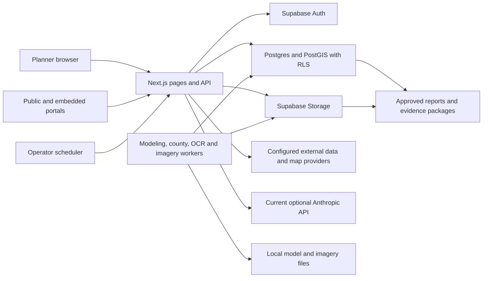

# OpenPlan architecture

Working description from the 2026-09-04 review. Confirm final source/release identity before publishing this as current documentation. The product contract defines the destination; this document describes the implemented structure and its important unfinished boundaries.

## Runtime and repository map

| Location | Responsibility |
|---|---|
| `openplan/` | Next.js/React/TypeScript web application, API routes, app scripts and Supabase migrations |
| `openplan/src/app/` | Authenticated planner pages, public/embedded portals, authentication and HTTP routes |
| `openplan/src/components/`, `src/lib/` | User controls, domain logic, source adapters, evidence and role/approval policies |
| `openplan/supabase/` | Local development stack configuration and forward migrations |
| `workers/` | AequilibraE, ActivitySim, county-onramp, OCR and ODM execution services |
| `scripts/modeling/`, `scripts/research/` | Offline scientific preparation, diagnosis, experiments and custody verification |
| `data/modeling/`, `schemas/` | Versioned published scientific evidence and its contracts; frozen studies are historical records |
| `qa-harness/` | Real-browser journeys, evidence checks, regression scripts and local-target protections |
| `.github/workflows/` | App, worker/script, RLS, browser, upgrade, recovery and source-contract checks with different triggers |
| `docs/` | Product contract, single roadmap, capability ledger, architecture, ADRs and dated research/reviews |

App commands run inside the nested `openplan/` package. Python and browser commands use their own declared roots/environments. A copied runtime is not identified by port alone; compare process working directory, source commit and reported deployment identity.

The diagram is a responsibility map, not a deployment or security certification. Worker-specific APIs and callbacks differ; read the relevant DEPLOY document before operating them.

## The planning record

Projects and statutory plans are the intended durable owners of context. Projects already connect delivery milestones, decisions, meetings, issues, funding and selected evidence. Generic Plans, Land Use Plans and RTP cycles have different structures. Generic linked-plan readiness must not be mistaken for the versioned legal/review/adoption process of a statutory plan.

Data Hub/workspace GIS owns source datasets and layers. Documents/Knowledge Base owns uploaded source documents and extraction. Analysis, Models/Scenarios and Safety produce evidence. Engagement owns campaigns, submissions, moderation and public-response records. Programs, Grants and Invoicing carry programming, award and reimbursement work. Reports and project evidence packages assemble selected records. My Work exposes assigned work and approvals. Aerial connects missions and processing outputs to planning evidence.

The implementation is not yet one seamless record. The review identifies independent translations at plan creation, workbook import, direct versus governed GIS export and source-to-report handoff. Extend existing owners and shared evidence builders rather than create another project registry, GIS stack or approval implementation.

## Geography and authority

`src/lib/geographies/place-resolver.ts`, the geography routes and StudyAreaPicker form the main place-selection path. `PlaceOfRecord` separates identity from exact geometry and deliberately leaves drawn areas without invented administrative identity. US-specific concepts belong in adapters/registries rather than shared core types.

Study extent, place identity, workspace home, adopting authority and legal applicability are different facts. At the reviewed commit, land-use legal descriptors are restricted by workspace home; that is a known semantic defect for client/overlapping/sovereign work. The roadmap extends plan-owned authority and plan-kind/version-specific rules. It does not claim those changes already exist.

All states/DC, California depth and explicit territory coverage remain governed by the product contract. Tribal and regional authorities cannot be inferred solely from enclosing state or county geometry. Unsupported, unknown, multistate and failed-read states stay distinct in the readiness system.

## Identity, permissions and approvals

Supabase Auth identifies users. Membership selects a workspace; the role vocabulary is owner, admin, member and viewer. The action matrix controls named application actions. PostgreSQL RLS, grants and immutable-record constraints enforce database boundaries, including linked child records. Separate service-role clients perform privileged operations and require their own narrow checks.

Public/share-token routes intentionally expose approved subsets. A valid share token is not permission to publish confidential originals. Exact artifact/payload hashes bind named review/approval records. The assistant action registry and route-local verification must retain distinct agent identity and human approval. Publication, adoption, spending and claim promotion remain human-controlled.

These foundations establish more than API convention, but they do not prove case-level confidentiality, agency records retention, tribal governance or every service-role side effect. Live RLS, public-derivative and revoked-access journeys must accompany relevant changes. Never infer a safe route solely because it imports an authorization helper.

## Long jobs and model science

AequilibraE and ActivitySim are separate demand methods. Shared networks/assignment and comparison boundaries support disciplined comparison; their results must never be averaged. ActivitySim execution exists. Borrowed behavioral parameters, period/mode representation, distribution, external travel, road loading and nationwide validation remain scientific gaps.

GTFS catalog, upload and refresh ingestion currently runs in a 300-second HTTP request, with durable version/custody state and abandonment cleanup but no resumable worker execution. Move the long work using those existing semantics after representative profiling.

General polling workers claim stages in Postgres. County-onramp jobs use a separate attempt/callback lifecycle. OCR and ODM have their own runtime and artifact contracts. Long work belongs in these workers, not in a serverless request. General-run reconciliation currently relies on stage timestamps while independent worker heartbeats live separately; healthy long ActivitySim silence needs explicit fault-tested reconciliation and attempt fencing.

Versioned scientific artifacts distinguish assignment-blind input/audit preparation from post-output diagnosis. Published v0.39-v0.44 studies are development evidence, not untouched nationwide acceptance. Consumed holdouts stay consumed. Rules-v5 remains diagnostic and inconclusive; a new preregistration alone cannot turn it into an acceptance evaluator. Each published use requires an implemented, preregistered and independently evaluated scientific gate.

Database custody, published files, loader checks and the actual production ingestion path are separate responsibilities. A correct published JSON file does not prove that every application run has persisted or displayed it correctly. Preserve raw residuals, unsupported observations and negative candidates.

## Data and external services

The current map implementation uses Mapbox GL and Mapbox-hosted styles; GIS placement preview sends an extent in a static-image URL. Census/TIGERweb/LODES, NHTSA FARS, California crash sources, OSM, grants and other domain adapters retrieve external data. Optional AI sends selected grounding/content to its configured provider. Self-hosted records do not imply no external traffic.

Operators need a maintained outbound-service inventory, source licenses, attribution, credentials, freshness and incomplete/outage behavior. The future local-capable renderer/data path must keep maps useful when outside services are disabled. Open-source libraries do not automatically grant rights to every source dataset or imagery tile.

Imports must preserve geometry, CRS/axis order, units, identifiers and source provenance. Exports declare exactly what they include. Workbook create-only import is distinct from edited-record reconciliation. Direct and governed GeoPackages currently assemble different selections; optional model/designation geometry support is not yet connected to those production calls.

## Deployment and durable state

The local Supabase CLI stack is for development/evaluation. Agency production self-hosting requires a separately configured and hardened Supabase deployment, Node app, worker processes, storage, authentication/email, scheduler and recovery procedure. The repository's local walkthrough helper is machine-specific and must not stand in for independent commissioning.

Durable state includes database records/auth state, Storage metadata and object bytes, local model/imagery artifacts, scientific source receipts/configurations, and the operator configuration/secrets needed to recover them. `.next`, dependency caches and browser profiles are not the authoritative planning record.

Migration deployment precedes app code that requires new schema. Read the actual release notes and rehearse nonempty upgrade paths; do not assume every future migration is backward-compatible merely because prior ones were. Rollback is a verified recovery procedure, not a destructive reset of the working stack.

Existing restore/upgrade drills cover representative records, not the complete documented backup mechanism and every local artifact. A completed full restore must prove semantic records, exact bytes, relationships, roles, published versions and continued work on a separate target.

## Verification and architectural decisions

Use focused behavior tests for observed defects, live database probes for permissions/custody, browser journeys for actual reachability, and independent people for usefulness and operations. Source-string guards protect narrow mechanical relationships and cannot certify workflow behavior. Each changed consequential guard needs a no-op survivor and a targeted failing mutation.

Read ADR-002 for the multi-engine choice, ADR-003 for crash-source acquisition and ADR-004 for agent-server intent. They preserve dated reasoning; verify current third-party APIs, licenses and protocol details before implementing from them. The roadmap owns future work. An architecture diagram or capability label never overrides measured failure.

## Proposed early extensions: participation, agent connections and capital delivery

These are roadmap designs, not implemented architecture. Nathaniel's September 4 priorities deepen three existing owners. Engagement retains campaign/question versions, source geometry and moderated public derivatives, then links responses and commitments to project/plan decisions. Projects retains the capital case through environmental, ROW/utilities, PS&E, procurement, construction and closeout; Documents, stage gates and Invoicing supply versioned evidence and separately reconciled payments/reimbursements. Rule applicability depends on actual authority, funding, agreement and effective date rather than workspace home.

The Planner Agent currently uses Anthropic API access. Proposed direct API adapters and a paired local connector expose installed Codex/Claude Code/OpenCode through one capability contract. T3 Code is the concrete reuse reference for native runtime control. The CLI owns its provider login; OpenPlan controls allowed case reads, proposed actions and exact human approval. A provider process has a separate lifecycle from a browser request. Personal device/account connections are distinct from deployment connections serving unattended jobs or public engagement. See the dated priority research and roadmap A0/M9/M10 for definitions of done.

Changing the model transport does not transfer legal, financial or scientific authority to the model. A CLI shell permission is not approval to publish a response, certify PS&E, accept construction, spend money or submit reimbursement. Those remain recorded domain decisions by authorized people.

## Proposed planning-contract and RTP ownership

The restored requirements extend existing owners. Projects owns delivery context; engagements own the commercial contract/task-order hierarchy; task allocations connect effort, people and deliverables. Source time/cost records retain one identity across internal cost, client invoice and funding-claim views. Approved baseline/rate versions, forecast assumptions and payment events need explicit history. Existing scalar budgets and mixed billed/spend totals do not implement that design yet. See M11 and the contract-budget review.

RTP owns the regional plan cycle, applicable elements, authored chapters and regional fiscal assumptions/rows. Documents owns predecessor bytes and cited pages; reviewed extraction and conflict decisions bind accepted content to the new cycle. A consultant contract for preparing an RTP belongs to M11's project budget; it is never added to the region's transportation financial element unless an actual regional-plan line independently requires it. M12 links plan-level policies, projects, measures, engagement responses and adoption versions to implementation. Existing extraction excludes chapter text from its ordinary launcher; current narrative machinery is a reuse starting point, not proof of the requested intake journey.
