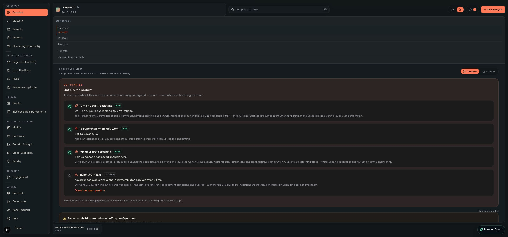
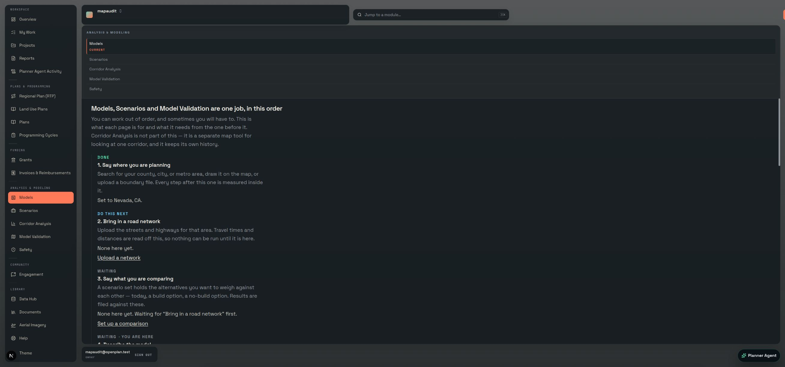
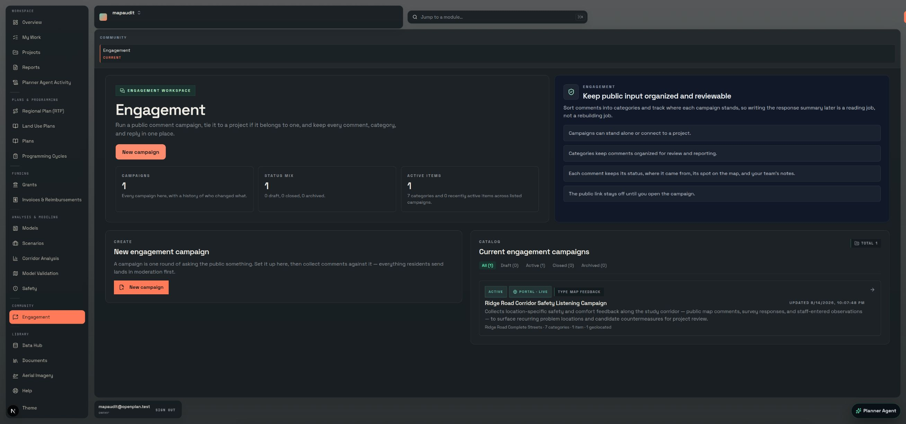
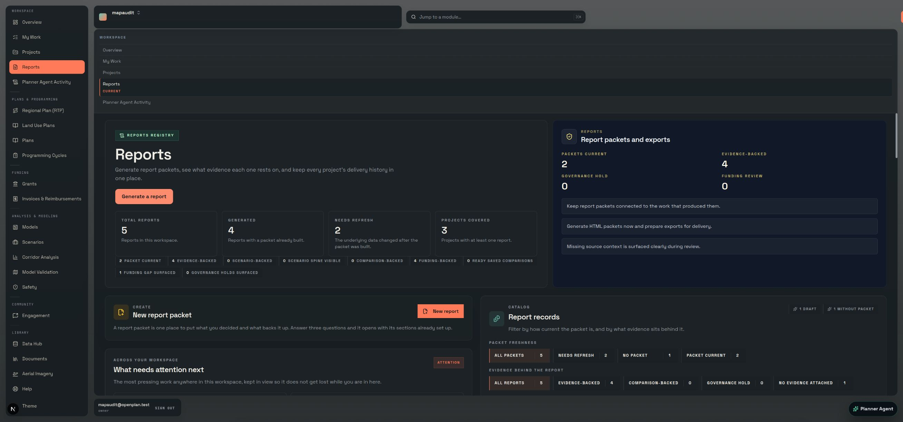
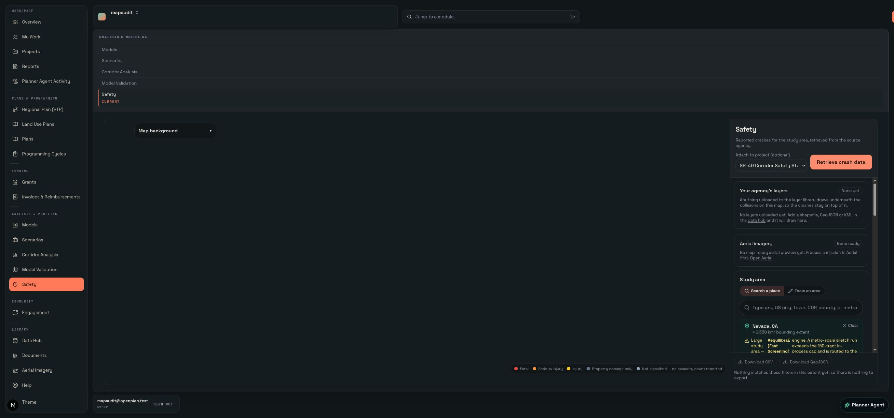

# OpenPlan v1 codebase and product review

**Codex review, 25 August 2026**<br>
**Code baseline:** v0.34.0 at `391eed25`<br>
**Roadmap:** [`docs/ROADMAP.md`](../ROADMAP.md)<br>
**Independent comparison:** [Claude's report](../ops/2026-08-25-v1-review-and-roadmap.md)

> **Post-review direction, 25 August 2026:** Nathaniel rejected the smaller v1
> premise below. The binding target is now the [ultimate US planning operating
> system](../product/V1_PRODUCT_CONTRACT.md): core work for every type of
> planner, all fifty states and DC, California as the gold standard, and both
> travel models independently validated nationwide. The
> [decision record](product-direction/2026-08-25-v1-direction.md), [capability
> matrix](../product/US_PLANNING_CAPABILITY_MATRIX.md), and current roadmap
> supersede this report's six-release scope and post-v1 deferrals. The original
> conclusions remain below so the independent review and disagreement are not
> rewritten after the fact.
>
> The repeated 43.3% model figure is also corrected by the later
> [traffic-count uncertainty research](../modeling/VALIDATION_OBSERVATION_UNCERTAINTY_RESEARCH_2026-08-25.md):
> it was measured on the roughly 30% calibration-selection holdout drawn from a
> 57-station, one-county dataset, not nationwide or independent accuracy
> evidence. The current nationwide error remains unknown.
>
> The project instruction twins were also reduced from roughly 4,800 words each
> to eight-line harness shims. Their current shared rules now live in the tracked
> [agent operating manual](../product/AGENT_OPERATING_RULES.md), eliminating
> closed prerequisites, volatile counts, stale backlog pointers, and duplicated
> history while keeping the rules that still prevent observed failures.

## Executive verdict

OpenPlan is capability-rich, evidence-strong, and operationally serious. It is
not yet one coherent product.

The repository does not need another module before v1. It needs its existing
workflows joined around projects and plans, tested to their intended outcomes,
and made legible to a planner who did not build the system. The strongest part
of OpenPlan is not the feature count. It is the machinery that distinguishes a
source from an inference, freezes consequential evidence, preserves negative
results, separates the agent from the planner, and fails closed when proof is
missing. That is a credible product advantage.

The live product currently makes the user do too much integration in their
head. Twenty authenticated destinations, duplicate navigation, repeated primary
actions, setup prose, and module-specific starting points sit on top of a data
model that is already much more connected than the interface suggests. Several
automated first-week jobs finish while recording that the intended outcome was
only partly reached. A completed script is not a completed planning job.

The new v1 contract is:

> A planning team anywhere in the United States can install and operate
> OpenPlan without Nathaniel, carry source material through analysis and public
> process to a defensible decision artifact, and know exactly what the evidence
> does and does not support.

The roadmap therefore starts with product coherence, expands the evidence gate
from seven scripts to twelve outcome journeys, then closes any-place, export,
team-governance, and model-disclosure gaps. It does not schedule a new module.

## A material correction to the parallel review

Claude's report identifies the largest live defect as an undisclosed
fatality-only "KSI" ranking outside California. The premise is important, but
the reported product behavior is not supported by the current code.

- `openplan/src/lib/safety/sources/fars.ts` declares FARS as fatal-only.
- `SAFETY_FATAL_ONLY_CAVEAT` says that injury and property-damage-only records
  are unavailable and must not be interpreted as zero.
- `safety-workspace.tsx` renders that caveat before live FARS results.
- The corridor evidence summary carries the same fatal-only boundary.
- FARS is not persistable. Stored KSI concentration records are not silently
  populated from the FARS live-read adapter.

Broader serious-injury coverage is worthwhile research. It is not the first v1
blocker, and the existing disclosure must not be replaced with a claim that it
is absent. The highest-impact observed defect is product coherence, followed by
first-week outcomes that still finish as `partly reached`.

## What I reviewed

This was an inventory-wide review and a risk-based deep review, not a claim that
every one of thousands of files received a line-by-line semantic audit.

I inspected:

- the complete Git graph, tags, release history, branch state, and all GitHub
  pull-request records;
- repository structure, application routes, migrations, workers, tests,
  generated code, largest source files, package scripts, and release guards;
- the canonical and dated documentation, instructions, plans, known issues,
  first-week evidence, modeling findings, ADRs, and release records;
- all indexed Claude project memories and plans, 38 Claude project transcripts,
  and the relevant 51 Codex session histories and memory registry entries;
- the running v0.34 product from the public landing page through the real signed-
  in navigation, visiting all 20 authenticated destinations;
- the current verification surfaces: application gate, live RLS tests, worker
  suites, production build, and GitHub CI.

I did not reopen consumed sealed evidence, rerun the permanently inconclusive
2017 NHTS source, submit an external form, provision infrastructure, or use
invented fixtures to make a journey look complete.

## Measured repository snapshot

| Measure | Current evidence |
|---|---:|
| Commits on `main` before the two review commits | 2,412 |
| Release tags | 33, v0.2.0 through v0.34.0; the changelog also records v0.1.0 |
| Merged pull requests | 98 |
| Closed, unmerged pull requests | 1, the superseded ActivitySim proposal |
| Open pull requests / issues | 0 / 0 |
| Tracked files | 3,961 |
| TypeScript and TSX files | 2,426 |
| Planner-facing `page.tsx` routes | 60 |
| API `route.ts` files | 256 |
| Database migrations | 223 |
| Vitest files | 1,103 |
| Python workers | 5 |
| Checkout size | 76 GB, mostly local modeling data |
| Packed Git objects | about 1.0 GB |
| Claude project history | 38 transcripts, about 814 MB including project state |
| Codex session store | 58 total transcripts, about 914 MB; 51 were OpenPlan-relevant |

Direct-to-main development after 22 July explains why the PR count is much
smaller than the commit count. That is consistent with the repository's current
"one clean main" rule, not evidence that later work was missing.

## What v1 should feel like

The organizing object should be the planner's work, not the software module.

```text
sources and documents
        │
        ▼
project or plan + selected geography
        │
        ├── analysis and scenarios
        ├── engagement and safety evidence
        ├── funding and delivery
        └── review and approvals
        │
        ▼
frozen, sourced artifact
        │
        ├── report or public packet
        ├── GIS or workbook export
        └── adopted or funded decision
```

This does not flatten the specialist tools. A modeler can still open validation
directly and an engagement manager can still work in campaigns. The interface
should preserve that depth while making the common path obvious and retaining
the project, geography, evidence, and approval context between steps.

## Live product review

The browser review started at `/`, signed in through the product, and used the
visible navigation. It did not jump directly into seeded test routes.

### Overview



The overview combines a global left rail with a second full horizontal module
navigation. The first screen is dominated by a checklist and operator setup
diagnostics. Those details are useful, but they compete with the planner's daily
questions: what needs my attention, what changed, and where does this project go
next?

### Modeling



Models, Scenarios, and Model Validation describe stages of one job but appear as
three top-level destinations. The page itself already has the beginnings of a
guided sequence. v0.35 should finish that sequence and retain the specialist
URLs, rather than building another model front door.

### Engagement



The module is real and reachable. The same creation action appears in the hero
and again in a large card. This is representative of a broader pattern: useful
capability presented as repeated cards rather than a compact status and one
clear next action.

### Reports



Reports repeats "Generate a report" and "New report" above the fold. More
important, the report should feel like the end of a project or plan workflow,
not a separate place where the planner reconstructs context.

### Safety



Safety connects live source boundaries, KSI work, countermeasures, and report
artifacts. Its remaining first-week gap is concrete: coordinates are not enough
place identity for a planner, and the printable packet needs a street-readable
map background.

### Responsive evidence

The mobile DOM and navigation were inspected at 390 by 844 pixels and remained
reachable. Screenshot capture timed out, so this review does not claim a visual
mobile pass. Responsive, keyboard, screen-reader, contrast, and print checks are
explicit v1 acceptance work.

## Module and workflow assessment

These are evidence states, not invented maturity scores.

| Surface | What is real now | v1 gap |
|---|---|---|
| Overview | Workspace state, checklist, notices, quick links | Daily work and operator diagnostics need separation |
| My Work | Review queue and personal work surface | Become the cross-module assignment and approval inbox |
| Projects | Portfolio, detail, priorities, imports, module handoffs | Make project context persist through every downstream workflow |
| Reports | Generated, frozen, source-aware artifacts | Start and finish naturally from the project or plan |
| Agent activity | Distinct principal and audit records | Keep as an accountability surface, not daily primary navigation |
| RTP | Broad statutory workflow and fiscal/public-review machinery | Prove one full adoption journey and named approvals |
| Land Use Plans | Shipped review, exact-hash adoption, maps, reports | Prove neutral degradation and a full configured-jurisdiction journey |
| Plans | Shared planning records | Clarify its relationship to RTP and land-use plan front doors |
| Programming cycles | Project lists and cycle workflow | Carry project context and approval responsibility through the cycle |
| Grants | Programs, matching, applications, evidence | Prove project-to-application handoff without re-entry |
| Invoices | Legitimate funder reimbursement, not billing | Stop asking for a workspace when one is already active |
| Models | Real AequilibraE and ActivitySim execution | One guided common-network workflow with honest runtime and evidence |
| Scenarios | Scenario construction and comparison | Present as a model stage, not a disconnected module |
| Corridor analysis | Cross-source corridor evidence | Improve entry, place identity, GIS export, and evidence state |
| Model validation | Counts, holdouts, calibration evidence | Integrate into the model journey and disclose per-link coverage |
| Safety | Crash sources, KSI, countermeasures, reports | Road names, printable street context, broader adapters where justified |
| Engagement | Campaigns, public maps/surveys, moderation, exports | Reduce duplicate setup, retain project/geography context end to end |
| Data Hub | Shared data inventory and source infrastructure | Make project use and coverage limits easier to trace |
| Documents | Upload, extraction, provenance, knowledge use | Surface the document from every artifact that depends on it |
| Aerial | Planning, imagery, worker, orthophoto, report seam | Prove the complete local worker and frozen-artifact journey |
| Help | In-product documentation | Reorganize around the twelve jobs rather than the module inventory |

## Strongest foundations

### Evidence custody and claim discipline

The repository has concrete mechanisms for source provenance, claim tiers,
exact-hash approval, frozen report artifacts, agent authorship, and fail-closed
behavior. The sealed-study runner now stages results durably and can recover
after interruption without reopening the consumed source. The inconclusive NHTS
result remains inconclusive. This is the standard the rest of v1 should inherit.

### Two independent demand methods

AequilibraE and ActivitySim both run. ActivitySim's population is synthesized
from real PUMS records fitted to published totals. Both demand tables use the
same network and assignment for comparison. The agreement map preserves
divergence rather than averaging it away. The scientific limit is the borrowed
regional coefficient set and observed accuracy, not missing engine execution.

### Human control over consequential actions

The action registry, proposal hashes, route verification, audit records, and
executable refusal tests give the assistant a narrow, reviewable role. New
write capabilities already have to earn an action or a recorded refusal. That
is the right base for the later MCP/Buzz control surface.

### Operational durability

Live RLS proof, backup and restore rehearsal, upgrade-path CI, worker health,
interruption recovery, npm audit, and production build are unusually complete
for a pre-v1 application. The remaining v1 work is to prove these mechanisms
through one team-and-recovery journey on the same release candidate.

## Ranked gaps

### 1. Product coherence

The information architecture exposes implementation modules more strongly than
planner jobs. Duplicate navigation and repeated primary controls add choice
without adding capability. Projects and plans already provide the right spine;
the missing work is carrying that context and presenting one next step.

### 2. Outcome evidence

The first-week harness has good browser discipline and can run seven jobs, but
its latest complete evidence includes `partly` outcomes. Safety still lacks road
identity and a print-usable base map. v1 needs twelve journeys and an outcome
verdict that can fail the release even if automation reaches its last line.

### 3. Any-place proof

The adapter and registry architecture is generally sound. Actual coverage is
uneven by source and legal bundle. Honest emptiness is better than false
coverage, but v1 requires a neutral-geography journey and disclosure beside
every affected result. Serious-injury adapters belong here as researched source
extensions, not as a claim that current fatal-only behavior is hidden.

### 4. Work leaving the system

Inbound support now includes workbook and GIS formats, while outbound planning
work is concentrated in CSV, GeoJSON, and PDF. GeoPackage, workbook round-trip,
and a per-project evidence manifest are the smallest useful bridge to agency
GIS and spreadsheet practice.

### 5. Team responsibility

Many write surfaces rely on membership plus a viewer exclusion. That does not
fully answer who may adopt, publish, obligate money, or approve a stage. The
system has exact artifact hashes; v1 should pair them with named human approval
and a cross-module My Work inbox.

### 6. Model evidence where values are read

The codebase has extensive modeling caveats and measured negative results. The
next step is not a fitted scalar. It is a per-link state that distinguishes
modeled, unloaded, and out-of-network values in the map and every downstream
artifact. The complete two-model journey must remain reachable and unaveraged.

## Codebase risks worth managing

### Concentrated files

Generated CRS data is correctly large, but several hand-maintained seams are
also substantial: `assistant/respond.ts` is about 208 KB,
`assistant/context.ts` 157 KB, `assistant/operations.ts` 152 KB, the report
generation route 111 KB, `workspace-summary.ts` 116 KB, and report HTML 95 KB.
Size alone is not a defect. These files sit at high-change joins, so new work
should extract a shared capability only when two callers need it or focused
tests reveal an unsafe seam. A cosmetic rewrite would add risk.

### Untyped database projections

Supabase clients are deliberately untyped. With 223 migrations, `.select()`
strings can drift at runtime. Existing projection assertions are the right
mechanism. Every touched read path should retain or add a focused projection
test rather than introducing a speculative repository-wide type-generation
project.

### Ratchet warnings

The dead-code gate passed but reports 476 unused-export warnings and two
duplicate-export warnings. They are not release failures today. Treat the list
as a shrink-only maintenance queue and do not bulk-delete working but currently
unwired capability.

### Local data footprint

The checkout is 76 GB, mostly model runs and caches. Those paths are ignored,
but the footprint increases backup, disk-pressure, and wrong-worktree risk.
Keep the tracked reference bundle explicit and give operators a safe inventory
and pruning command before v1. Do not delete existing run evidence by default.

### Metadata warning

The production build succeeds but warns that `metadataBase` is unset. This is a
small public-surface defect because social and canonical image URLs can resolve
against the development origin. Fix it in the coherence release and prove the
generated metadata uses the configured public URL.

## History and process findings

### Release pace

OpenPlan accumulated more than 2,400 mainline commits and 34 changelog releases
in six months. The August history is especially dense. The pace built real
capability, but it also let release-sized goals substitute for a product-level
destination. The roadmap now defines v1 first and derives releases from it.

### Pull requests

The 98 merged PRs document the earlier review workflow. The absence of open PRs
and later direct-main commits matches the explicit current policy. There is no
hidden PR backlog to recover. The one closed, unmerged ActivitySim PR is
superseded by the implementation now on main.

### Agent histories and memories

The histories repeatedly rediscovered four themes: stale roadmaps, first-week
outcomes, model honesty, and invisible shipped features. Claude archived 50 of
115 project memory files and 29 of 34 private plans, retaining the current
indices and evidence. Codex memory still described the v0.33 portfolio importer
as research-only after it shipped in v0.33 and v0.34; a supersession note now
points future sessions to the current roadmap and release state.

Raw transcript stores remain large. They are useful audit records and were not
deleted. Active indices should route agents to a small current set, while raw
history stays an archive rather than entering every prompt.

## Documentation and instruction cleanup performed

- Replaced the release-history roadmap with the v1 product contract and twelve
  acceptance journeys.
- Preserved Claude's independent report unchanged for the requested comparison.
- Archived the February platform prototype under `docs/archive/plans/`; it
  described Next.js 15, MapLibre, pnpm, and a transit-only product that no
  longer matches OpenPlan.
- Corrected the root modeling setup from two worker settings to three and
  required different request and callback tokens.
- Removed the stale six-minute model promise and restored the hours-to-days,
  accuracy-first posture.
- Replaced obsolete pnpm audit instructions with the actual npm audit gate.
- Removed a stale public-demo instruction and directed team operators to the
  current deployment guide.
- Replaced "laptop" with "computer" in current setup documentation.
- Reconciled the compact worker-test paragraph in the project instruction
  twins and copied missing common safety rules into the global Claude twin,
  while preserving the harness-specific browser policies.
- Updated the technical-record index without rewriting dated evidence.

No dated validation record, shipped decision, migration comment, sealed-study
receipt, or negative result was rewritten to fit the new roadmap.

## Roadmap summary

| Release | User outcome | Acceptance evidence |
|---|---|---|
| v0.35 | One coherent product | Project, engagement, safety, and corridor journeys all reach their outcomes without duplicate choices or lost context |
| v0.36 | Any-place proof | California and neutral-state journeys; coverage and hardcoding mutations fail |
| v0.37 | Work round-trips | GeoPackage in QGIS, XLSX portfolio round-trip, evidence manifest |
| v0.38 | Real team responsibility | Analyst, approver, viewer, My Work, named exact-artifact approval |
| v0.39 | Complete evidence loop | Common-network dual-model report, per-link evidence state, engagement and safety corroboration |
| v0.40 | Stranger test | Twelve reached outcomes, independent install, accessibility, recovery, full release gate |
| v1.0.0 | Contract is true | Tag the proven candidate, without inventing another capability release |

The detailed scope and permanent refusals live in
[`docs/ROADMAP.md`](../ROADMAP.md).

## Claude and Codex comparison

| Question | Claude report | Codex conclusion |
|---|---|---|
| Core diagnosis | Strong discipline, no product destination | Strong evidence system, but the live product is not yet coherent |
| v1 definition | Install, seven first-week jobs, defend every number | Self-service team, one product, any place, twelve outcomes, defensible handoff |
| First priority | Serious injuries outside California | Product coherence and partly reached first-week outcomes |
| Safety finding | Fatal-only limit not disclosed at ranking | Disclosure exists; broaden sources as researched any-place work |
| Export | GeoPackage, XLSX, evidence bundle | Agreed |
| Governance | Extend roles and approvals | Agreed, with My Work as the common inbox |
| Modeling | Disclose link coverage; defer scalar | Agreed; also prove the full dual-model journey |
| UI evidence | Repository-centered review | Live review of all 20 signed-in destinations added |
| Acceptance gate | Seven jobs, zero blocked/failed | Twelve jobs, only `reached` passes; completed-plus-partly fails |

The reports agree on OpenPlan's unusual evidence strength, export gap, team
approval gap, model-disclosure need, self-service stranger test, and deferral of
agentic control. The main disagreement is priority. Live UI and latest
first-week evidence put coherence before new source coverage.

## Verification

At Claude's review commit `5db0dd4f`, before these documentation-only changes:

- `npm run qa:gate`: passed.
  - 1,101 test files passed, 2 skipped.
  - 12,515 tests passed, 77 skipped.
  - 107 live RLS tests passed.
  - npm audit found zero vulnerabilities.
  - webpack production build completed with 124 static pages.
- `npm run test:workers`: all 47 discovered suites passed across five workers.
- GitHub CI and RLS Isolation: passed.

For the final documentation commit, the active-roadmap guard was mutation-
tested by replacing one required path with a nonexistent path, observing the
focused test fail for that missing reference, restoring the path, and observing
the test pass. Links and local assets were checked, the HTML report was served
locally and inspected in a browser, and final GitHub checks were read after the
push.

After Nathaniel set the larger v1 direction, the new recurring direction guard
was separately proved with four mutations: a comment-only change survived; a
missing binding decision failed for that decision; a removed planning
capability failed for that capability; and a changed packet heading failed the
packet test. A broken validation-research reference also failed closed on the
exact expected path. All mutations were restored.

The updated code and initial direction mechanism passed `npm run qa:gate`:
1,102 test files and 12,517 tests passed, 107 live RLS tests passed, npm audit
found no vulnerabilities, and the production build generated 124 static pages.
The build still reports the known `metadataBase` warning now scheduled in the
immediate roadmap checkpoint. After the instruction cleanup and final reference
updates, the direction and active-roadmap focused tests passed again.

The HTML companion was then inspected in Chrome at desktop and 390 by 844. All
five tabs are visible at the narrow width, the intended tables scroll inside
their containers without page-level overflow, and no console warning or error
was observed. The direction guard can enforce freshness, required vocabulary,
and mechanical references; it cannot determine whether a reviewer told the
truth or whether a coverage cell deserves `proven`. Real journeys and
independent review remain necessary.

## What remains uncertain

- No independent stranger has completed the install. That cannot be inferred
  from agent success and remains a v0.40 gate.
- Mobile visual capture failed during this review. DOM reachability is not a
  substitute for the responsive and accessibility pass in the roadmap.
- State serious-injury availability was not researched in this review. The
  roadmap requires primary-source research before registering adapters.
- The unused-export warning count does not distinguish dead capability from
  intentionally exported extension seams. A shrink-only, file-by-file review
  would settle each item.
- A 76 GB checkout is not itself a product defect. Disk inventory during a real
  operator run would determine whether a safe cache-management feature belongs
  before v1.

## Final recommendation

Start v0.35 with the authenticated shell and the project-to-workflow context
seam. Do not start another module, a nationwide scalar sweep, or the Buzz client.
The immediate proof target is simple to state and hard to fake: four existing
planning jobs reach their actual outcomes without the user reconstructing
context or choosing between duplicate controls.

At the v1 milestone, raise the deferred MCP/Buzz server again. The action
registry and approval boundary are being built correctly for it, but the base
product must first be complete without any agent.
